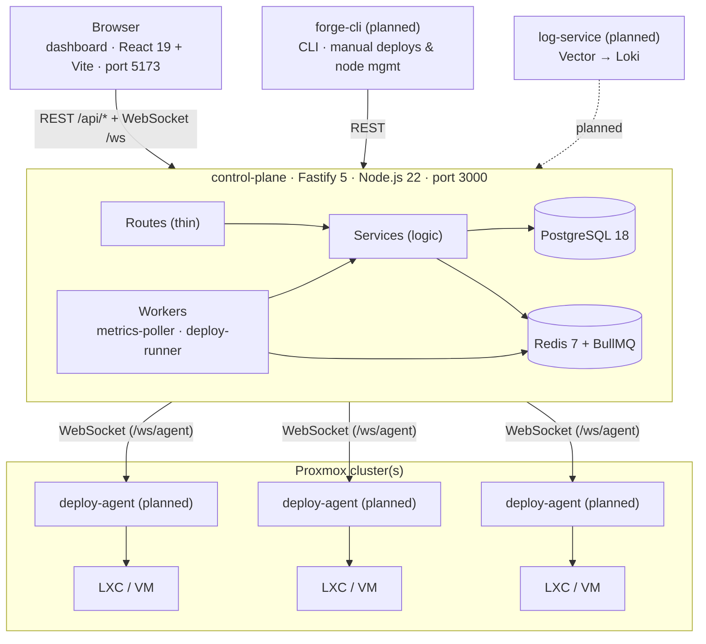

# Architecture

## System overview



**dashboard** — React 19 SPA served by Vite on port 5173. In development, Vite proxies `/api/*` and `/ws` to the control plane at `localhost:3000` so there are no CORS concerns locally. In production, serve the built `dist/` behind the same origin as the API (or configure `CORS_ORIGIN`).

**forge-cli** (planned) — CLI for manual deploys and node management, talks to the control-plane REST API.

**log-service** (planned) — Log aggregation from containers, likely via Vector → Loki.

---

## Dashboard internals

```
src/
├── main.tsx               QueryClient setup, RouterProvider, ToastProvider, WS connect
├── router.ts              Route tree assembly (rootRoute → loginRoute + layoutRoute → pages)
├── root-route.ts          createRootRoute — no auth, no layout
├── layout-route.tsx       Auth guard (beforeLoad) + AppLayout wrapper for authenticated pages
│
├── lib/
│   ├── api.ts             Typed fetch wrapper — attaches Bearer token, handles 401 → logout
│   ├── ws.ts              WebSocket singleton — exponential backoff reconnect, on/send/connect
│   └── utils.ts           cn(), formatBytes(), formatUptime(), formatRelative(), etc.
│
├── stores/
│   ├── auth.ts            Zustand — { token, user, login(), logout() } — sessionStorage
│   └── ui.ts              Zustand — { theme, sidebarCollapsed } — localStorage
│
├── hooks/
│   ├── useNodes.ts        TanStack Query hooks for nodes
│   ├── useGuests.ts       Guests, power actions, snapshots
│   ├── useMetrics.ts      WS metrics subscription + 60-entry ring buffer
│   ├── useDeploy.ts       Deploy targets and jobs
│   ├── useDeployLogs.ts   Live (WS) or historical (REST) deploy logs
│   ├── useAgents.ts       Agent list, WS-driven invalidation
│   └── useAudit.ts        Audit log with cursor pagination
│
├── components/
│   ├── layout/            AppLayout, Sidebar, TopBar
│   ├── ui/                Badge, Button, Input, Label, Skeleton, Tabs, Toast, …
│   ├── metrics/           CpuChart, MemoryChart, NetworkChart, GuestMetricsSparkline
│   └── terminal/          Terminal (xterm.js + FitAddon + ResizeObserver)
│
└── pages/
    ├── login.tsx
    ├── index.tsx          Dashboard overview
    ├── nodes/
    │   ├── index.tsx      Node list
    │   └── $nodeId/
    │       ├── route.ts   nodeIdRoute (layout)
    │       ├── index.tsx  Node detail + guest list
    │       └── guests/
    │           └── $vmid.tsx  Guest detail (metrics, snapshots, terminal, commands)
    ├── deploy/
    │   ├── index.tsx      Deploy targets + trigger
    │   └── $jobId.tsx     Job detail + live log viewer
    ├── agents/
    │   └── index.tsx      Agent registry
    ├── audit/
    │   └── index.tsx      Audit log
    └── settings/
        └── index.tsx      Theme toggle, password change
```

Key design choices:
- **Route splitting** — `root-route.ts` has no imports from pages; `layout-route.tsx` holds the auth guard + `AppLayout`; `router.ts` assembles the tree. This avoids circular imports.
- **WS singleton** — `ws.ts` is a module-level singleton. Components subscribe via `ws.on()` inside `useEffect` and unsubscribe on cleanup.
- **Metrics ring buffer** — `useMetrics` keeps the last 60 samples in a `useRef` array and flushes to state at most once per animation frame.
- **exactOptionalPropertyTypes** — all optional fields use the spread pattern (`...(x ? { field: x } : {})`) to satisfy the strict tsconfig inherited from the workspace root.

---

## Control-plane internals

```
src/
├── config.ts          Zod-validated env vars — process exits on bad config
├── errors.ts          AppError class — maps to ApiError envelope (@ninja/types)
├── app.ts             Fastify factory — registers plugins, routes, WS, error handler
├── index.ts           Entry point — connects Redis, starts workers, starts server
│
├── plugins/           Fastify plugins (registered in app.ts)
│   ├── auth.ts        JWT verification (jose), request.user decorator, authenticate prehandler
│   ├── rbac.ts        requireRole(minimum) — enforces admin > operator > viewer
│   ├── cors.ts        @fastify/cors — origins from CORS_ORIGIN env
│   ├── rate-limit.ts  @fastify/rate-limit — global + per-route overrides
│   └── swagger.ts     @fastify/swagger + @scalar/fastify-api-reference at /api/docs
│
├── routes/            Thin handlers: parse → call service → return
│   ├── auth/          POST /api/auth/login, PUT /api/auth/password
│   ├── nodes/         CRUD + sync for Proxmox nodes
│   ├── guests/        Guest list, power actions, snapshots
│   ├── deploy/        Deploy targets (CRUD) and jobs (trigger, cancel, logs)
│   ├── agents/        Agent list and delete
│   ├── webhooks/      POST /api/webhooks/github (HMAC-verified)
│   └── audit/         GET /api/audit (paginated)
│
├── services/          All business logic and database access
│   ├── auth.ts        bcrypt password hashing, JWT signing
│   ├── crypto.ts      AES-256-GCM encrypt/decrypt (Proxmox secrets at rest)
│   ├── node.ts        Node CRUD — encrypts/decrypts token_secret
│   ├── proxmox.ts     Proxmox VE REST API client (fetch + undici, TLS-insecure)
│   ├── deploy.ts      Target/job CRUD, triggerDeploy, appendLogLine, transitionState
│   ├── agent.ts       Agent registration, JWT issuance, in-memory WebSocket registry
│   ├── audit.ts       Fire-and-forget audit log writes
│   └── webhook.ts     GitHub HMAC signature verification, workflow_run handler
│
├── workers/
│   ├── metrics-poller.ts  BullMQ repeatable job — polls Proxmox every 5s, broadcasts via WS
│   └── deploy-runner.ts   BullMQ worker — dispatches queued jobs to connected agents
│
├── ws/
│   ├── session.ts         In-memory map of connected browser WebSocket clients + subscriptions
│   ├── router.ts          /ws endpoint — routes ClientMessage types to handlers
│   ├── agent-router.ts    /ws/agent endpoint — handles agent auth, heartbeats, results
│   └── handlers/
│       ├── auth.ts        WS auth message → verifyToken → sessionManager.authenticate
│       ├── metrics.ts     subscribe/unsubscribe metrics for a guest
│       ├── deploy.ts      subscribe/unsubscribe deploy job output
│       └── terminal.ts    SSH terminal stub (not yet implemented)
│
└── db/
    ├── client.ts          postgres.js singleton
    ├── redis.ts           ioredis singleton
    └── migrations/
        └── 001_init.sql   All tables — see Database schema below
```

---

## Auth model

### User auth

1. `POST /api/auth/login` — returns a signed JWT (`jose`, `HS256`, signed with `JWT_SECRET`)
2. Every subsequent request includes `Authorization: Bearer <token>`
3. The `authenticate` prehandler verifies and decodes the token, populates `request.user`
4. `requireRole(minimum)` prehandler checks `admin > operator > viewer` hierarchy

### Agent auth

1. Agent sends `POST` (or WS `auth` message) with `{ nodeId, vmid, hostname, version, secret }`
2. `secret` is validated against `AGENT_SECRET` — matches → agent is upserted in DB and issued its own JWT
3. Agent authenticates its WebSocket connection with this JWT via an initial `auth` message
4. Agent JWT uses the same signing key but is identified by `sub = agentId`

### WebSocket auth

- Browser `/ws`: send `{ type: "auth", token: "<user JWT>" }` within 10 seconds of connecting
- Agent `/ws/agent`: send `{ type: "auth", agentId: "...", token: "<agent JWT>" }` within 10 seconds
- Connections that don't authenticate in time are closed with code 1008

---

## Data flow: deploy pipeline

```
1. GitHub workflow completes
   → POST /api/webhooks/github (HMAC verified)
   → webhook service finds matching deploy_target by repo + branch
   → deploy service creates deploy_job (state: queued)
   → BullMQ enqueue

2. deploy-runner worker picks up job
   → looks up target + agent for (nodeId, vmid)
   → if agent offline → job failed
   → transitions job to dispatched
   → sends AgentCommand { type: "deploy", ... } over /ws/agent

3. Agent executes deploy
   → streams AgentResult { type: "deploy_log", ... } back over WS
   → control plane appends to deploy_log_lines, broadcasts to subscribed browsers
   → on finish → AgentResult { type: "deploy_finished", exitCode }
   → control plane transitions job to success/failed

4. Browser receives real-time updates via /ws
   → subscribe_deploy { jobId }
   → receives deploy_update and deploy_log messages
```

---

## Database schema

| Table | Description |
|---|---|
| `users` | Admin/operator/viewer accounts, bcrypt password hashes |
| `nodes` | Proxmox node connection details; `token_secret` is AES-256-GCM encrypted |
| `agents` | Registered deploy agents (one per container); tracks status and last seen |
| `deploy_targets` | Maps a `repository + branch` to a `nodeId + vmid` with deploy config |
| `deploy_jobs` | One row per deploy run; tracks state, timing, exit code |
| `deploy_log_lines` | Streamed stdout/stderr from agents, ordered by `seq` |
| `saved_commands` | Reusable shell commands per container (UI feature) |
| `audit_log` | Immutable record of all significant actions with user, IP, metadata |
| `_migrations` | Internal table tracking applied SQL migration files |

---

## API route inventory

| Method | Path | Min role | Description |
|---|---|---|---|
| POST | `/api/auth/login` | public | Issue JWT |
| PUT | `/api/auth/password` | any | Change own password |
| GET | `/api/nodes` | viewer | List Proxmox nodes |
| GET | `/api/nodes/:id` | viewer | Get node |
| POST | `/api/nodes` | admin | Add node (tests connectivity first) |
| PUT | `/api/nodes/:id` | admin | Update node |
| DELETE | `/api/nodes/:id` | admin | Delete node |
| POST | `/api/nodes/test` | admin | Test connection without saving |
| POST | `/api/nodes/:id/sync` | operator | Re-check node connectivity |
| GET | `/api/nodes/:nodeId/guests` | viewer | List guests on a node |
| POST | `/api/nodes/:nodeId/guests/:vmid/power` | operator | Power action (start/stop/reboot/…) |
| GET | `/api/nodes/:nodeId/guests/:type/:vmid/snapshots` | viewer | List snapshots |
| POST | `/api/nodes/:nodeId/guests/:type/:vmid/snapshots` | operator | Create snapshot |
| DELETE | `/api/nodes/:nodeId/guests/:type/:vmid/snapshots/:name` | operator | Delete snapshot |
| GET | `/api/deploy/targets` | viewer | List deploy targets |
| GET | `/api/deploy/targets/:id` | viewer | Get target |
| POST | `/api/deploy/targets` | admin | Create target |
| PUT | `/api/deploy/targets/:id` | admin | Update target |
| DELETE | `/api/deploy/targets/:id` | admin | Delete target |
| GET | `/api/deploy/jobs` | viewer | List jobs (filter by target, state, limit) |
| GET | `/api/deploy/jobs/:id` | viewer | Get job |
| POST | `/api/deploy/jobs` | operator | Manually trigger deploy |
| DELETE | `/api/deploy/jobs/:id` | operator | Cancel job |
| GET | `/api/deploy/jobs/:id/logs` | viewer | Get job log lines |
| POST | `/api/webhooks/github` | HMAC | GitHub workflow_run webhook |
| GET | `/api/agents` | admin | List agents |
| DELETE | `/api/agents/:id` | admin | Delete agent |
| GET | `/api/audit` | admin | Paginated audit log |
| GET | `/api/docs` | public | Scalar API reference |
| GET | `/healthz` | public | Health check |
| WS | `/ws` | auth msg | Browser real-time channel |
| WS | `/ws/agent` | auth msg | Agent command/result channel |

---

## WebSocket message types

### Browser client → server (`/ws`)

| Type | Description |
|---|---|
| `auth` | Authenticate with user JWT |
| `subscribe_metrics` | Subscribe to live guest metrics |
| `unsubscribe_metrics` | Unsubscribe from guest metrics |
| `subscribe_deploy` | Subscribe to deploy job output |
| `unsubscribe_deploy` | Unsubscribe from deploy job |
| `subscribe_logs` | Subscribe to log stream (not yet implemented) |
| `unsubscribe_logs` | Unsubscribe from log stream |
| `terminal_open` | Open SSH PTY session (not yet implemented) |
| `terminal_input` | Send input to PTY |
| `terminal_resize` | Resize PTY |
| `terminal_close` | Close PTY session |

### Server → browser client

| Type | Description |
|---|---|
| `auth_ok` | Authentication succeeded |
| `auth_error` | Authentication failed |
| `metrics_guest` | Live guest CPU/memory/disk/network |
| `metrics_node` | Live Proxmox node metrics |
| `deploy_update` | Deploy job state change |
| `deploy_log` | Deploy log line (stdout/stderr) |
| `terminal_output` | PTY output |
| `terminal_closed` | PTY session ended |
| `error` | Generic error |

### Agent → server (`/ws/agent`)

| Type | Description |
|---|---|
| `auth` | Authenticate with agent JWT |
| `heartbeat` | Status update (idle/busy, current job) |
| `result` | Deploy result: `deploy_started`, `deploy_log`, `deploy_finished`, `pong` |

### Server → agent

| Type | Description |
|---|---|
| `auth_ok` | Authentication succeeded |
| `command` | Command to execute: `deploy`, `cancel`, `ping` |
| `error` | Generic error |

---

## Key design rules

- **Thin routes** — handlers only validate input, call a service, and return. No business logic.
- **Services own logic** — all DB access and business rules live in `src/services/`.
- **No service-to-service imports** — shared logic goes to `src/lib/`. Services are singletons.
- **Tagged template SQL** — all queries use `postgres.js` tagged templates. No ORM, no query builder.
- **Zod as source of truth** — all shared types live in `packages/types`, defined as Zod schemas. TypeScript types are inferred with `z.infer<>`. No local type redefinitions.
- **AppError only** — services throw `AppError` instances. The global error handler maps them to the `ApiError` response envelope.
- **Env validated at startup** — `src/config.ts` parses `process.env` through Zod. Process exits immediately if any required var is missing or malformed.
